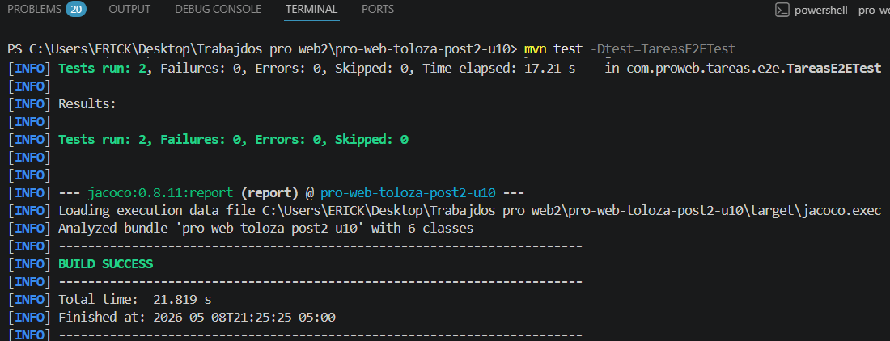
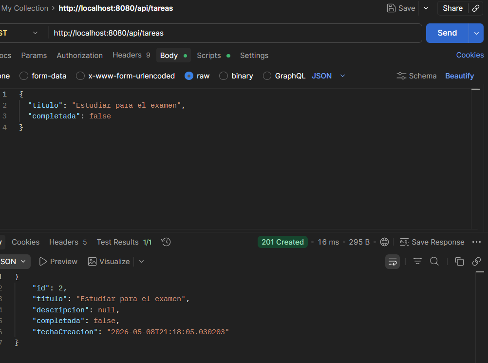

# U10 Post 2 - Pruebas E2E con Selenium, Postman y Newman

## Descripción
Implementación de pruebas end-to-end (E2E) en una aplicación Spring Boot de gestión de tareas, utilizando Selenium WebDriver con el patrón Page Object Model, colecciones Postman con test scripts, y automatización con Newman en GitHub Actions.

## Requisitos
- Java 17+
- Spring Boot 3.2.x
- Maven 3.9.x
- Google Chrome (última versión estable)
- Node.js 18+ (para newman)
- Postman 11+ (opcional, para pruebas manuales)
- GitHub Actions (CI/CD)

## Estructura del Proyecto
```
src/main/java/com/proweb/tareas/
├── entity/
├── repository/
├── service/
├── controller/
└── view/
    └── TareasViewController.java    # Vista HTML

src/test/java/com/proweb/tareas/e2e/
├── TareasPage.java                 # Page Object para la lista
├── NuevaTareaPage.java             # Page Object para agregar
└── TareasE2ETest.java              # Tests E2E

postman/
├── ColeccionToDo.json              # Colección con 5+ requests
├── env-local.json                  # Entorno local
└── env-ci.json                     # Entorno CI/CD

.github/workflows/
└── api-tests.yml                   # Pipeline con Newman
```

## Ejecución Local

### 1. Inicia la Aplicación
```bash
mvn spring-boot:run
```
Disponible en: http://localhost:8080

### 2. Ejecutar Selenium E2E Tests
```bash
mvn -Dtest=TareasE2ETest test
```

### 3. Ejecutar Pruebas Postman
#### Opción A: Con Postman Desktop
1. Importar `postman/ColeccionToDo.json`
2. Seleccionar entorno `env-local.json`
3. Ejecutar colección con Runner

#### Opción B: Con Newman (CLI)
```bash
npm install -g newman
newman run postman/ColeccionToDo.json -e postman/env-local.json
```

## Checkpoints Implementados

### ✓ Checkpoint 1: Page Objects con Selenium
- **TareasPage**: Selectores para lista de tareas
- **NuevaTareaPage**: Selectores para formulario
- Uso de By.id y By.cssSelector (selectores robustos)
- Métodos descriptivos: crearTarea(), filtrarPorEstado(), etc.

### ✓ Checkpoint 2: Colección Postman
- 5+ requests HTTP (POST, GET, PUT, DELETE)
- Test scripts que verifican:
  - Status code (200, 201, 404, etc.)
  - Body contiene campos esperados
  - Variables de entorno guardadas (ej: task_id)
- Entornos separados: local vs CI

### ✓ Checkpoint 3: GitHub Actions con Newman
- Workflow en `.github/workflows/api-tests.yml`
- Pasos:
  1. Checkout código
  2. Setup Java y Maven
  3. Compilar app
  4. Iniciar Spring Boot
  5. Setup Node.js
  6. Instalar Newman
  7. Ejecutar colección Postman
- Status visible en GitHub (check verde ✓)

## Evidencias

### E2E Selenium Tests


### Postman Collection Runner


## Tecnologías
- **Selenium WebDriver**: Automatización navegador
- **WebDriverManager**: Gestión de drivers
- **Postman**: Diseño y prueba de APIs
- **Newman**: Ejecución Postman en CI/CD
- **GitHub Actions**: Pipeline de automatización

## Commits Realizados
- `chore: importar base de tareas`
- `test: agregar selenium y page objects`
- `chore: agregar Postman y workflow CI`
- `test: estabilizar umbral de tiempo en Postman`
